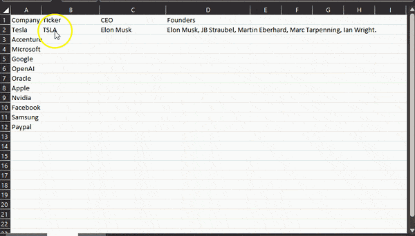

# ChatGPT Excel Function

A simple function for communicating with the OpenAI ChatGPT API in Microsoft Excel. This was tested under the latest version of Microsoft Excel. Adjustments may be needed to run with older versions.

# Update

Added a ChatGPTQuickFill() function, you pass in the number of cells you want to look backward for on the fill (if the cells don't exist or are empty they are ignored).  No prompt engineering required, the prompt is engineered automatically.  

Here's a demo video of the new Quick Fill:
(https://www.youtube.com/watch?v=t9rUA67DV0E)

## Demo

## Installation

These instructions may only apply to recent versions of Microsoft Windows. You will need:

1. Open Microsoft Excel and click on the "Developer" tab.
2. Click on the "Visual Basic" button.
3. In the "Microsoft Visual Basic for Applications" window, click on "Insert" and then "Module".
4. Replace the existing code with the code in the "chatgpt-excel-function.vba" file.
5. Replace `sk-YOUR-CHATGPT-KEY-HERE` with your own OpenAI API key.

## Usage

Prompt chatGPT in a cell by typing `=ChatGPT(prompt)`, where `prompt` is the text you want to send to the ChatGPT API.

Quick fill cells without a prompt using `=ChatGPTQuickFill(optional titleCell, optional contextCell)` where title row and context row default to row 1, and column a.  A prompt will be automatically generated.

## Troubleshooting

If you receive an error related to `WinHttp.WinHttpRequest.5.1`, it means that the `WinHttp` library is not registered on your computer. To resolve this issue, you can try re-registering the library by running the following command in an elevated command prompt:

regsvr32 %systemroot%\system32\winhttp.dll

If the error persists, you may need to reinstall the library. You can download it from the Microsoft website.

## Note
The `UnescapeString` function is used to format the response from the API into a human-readable format. If you encounter any errors or unexpected output, please refer to the comments in the code for further assistance.

## Disclaimer
The authors and contributors of this program provide it as-is, without any warranties or guarantees. They cannot be held responsible for any damages resulting from the use of this program.

## License
This program is licensed under the MIT license.

## Author
Johann Dowa
